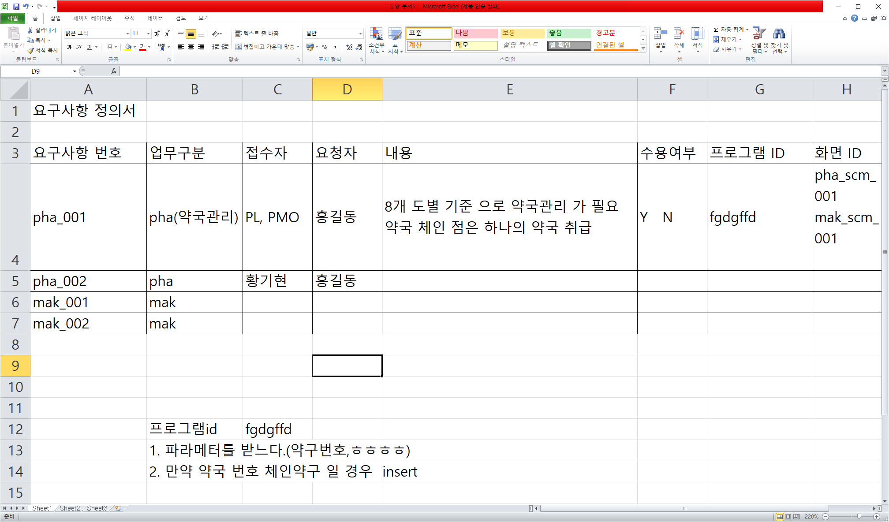
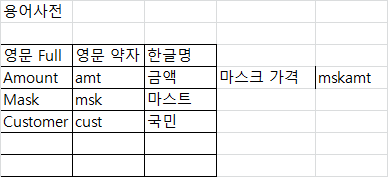
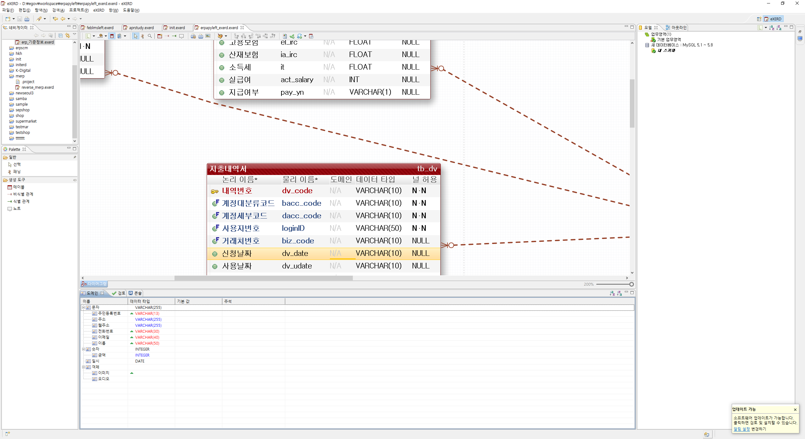
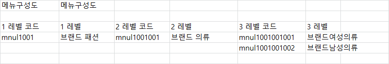
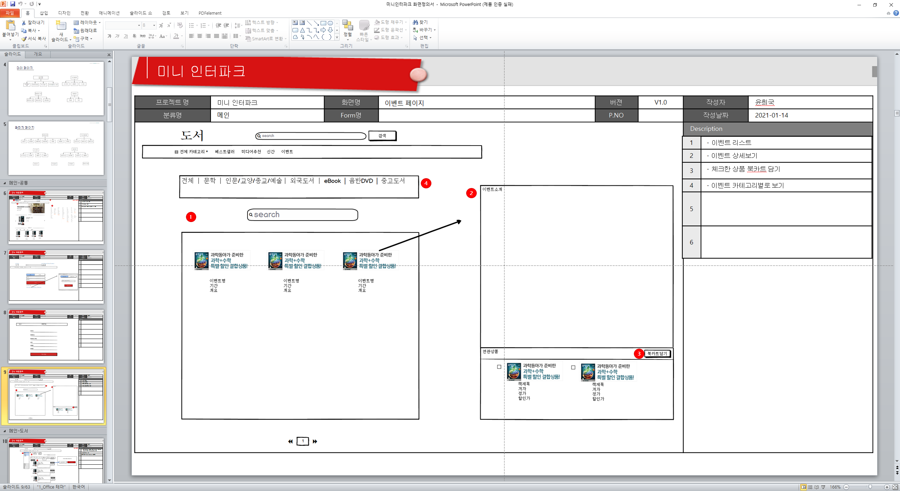
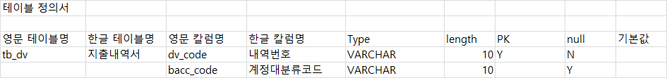

# ✅ [5/23] 프로젝트 산출물

> - 산출물 목록은 대개 아래와 같지만, 프로젝트마다 다르게 요구될 수 있음
>   - (1) 개발표준정의서
>   - (2) 현행시스템분석서
>   - (3) 요구사항정의서
>   - (4) 용어사전
>   - (5) 도메인정의서
>   - (6) 메뉴구성도
>   - (7) 화면정의서
>   - (8) ERD
>   - (9) 테이블정의서
>   - (10) 단위테스트 수행보고서 및 시나리오
>   - (11) 통합테스트 수행보고서 및 시나리오
>   - (12) 사용자매뉴얼
>   - (13) 관리자매뉴얼
>   - (14) 운영자매뉴얼

- (1) 개발표준정의서
  - 목적
    - 여러 사람이 개발한 것을 마치 한 사람이 개발한 것처럼 만들기 위해 표준을 정하고,  운영 과정에서 정해진 표준을 참조
  - 내용
    - 업무 약자 (ex. PHA 약국관리 MSK 마스크관리)
    - function 네이밍 규칙 s+(사용자정의 10자리 내외)
    - 변수 규칙 (ex. Java 에서 문자열 변수는 str+12312334 구조)
    - 들여쓰기 규칙
    - SQL문 셀렉트박스 id 규칙
    - ...

- (2) 현행시스템분석서

  - 목적
    - 2005년 이전에는 회사마다 신규 시스템을 구축하기 위해 프로젝트를 진행했지만, 이후부터는 기존 시스템에 신규 기능 변경을 더하고 신기술 추가하는 식으로 프로젝트가 변형됨
    - 위 작업을 위해 필요하게 된 것이 현행시스템분석서. 기존 시스템이 어떻게 돌아가고 있는 것인지를 설명

  - 내용
    - 프로그램 목록/기능 설명
    - 테이블 구성도(ERD)
    - 인터페이스 정의서 
    - …

- (3) 요구사항정의서

- (4) 용어사전

- (5) 도메인정의서

- (6) 메뉴구성도 

- (7) 화면정의서

- (8) ERD
  - E-R 다이어그램
  - eXERD, ERDCloud 등 활용하여 작성

- (9) 테이블정의서 (DBMS 마다 SQL 쿼리문 넣으면 테이블명세서 제작 해주는 기능이 있음)

- (10) 단위테스트수행보고서 및 시나리오
  - 참고자료 : https://smart-life-studio.tistory.com/332

- (11) 통합테스트수행보고서 및 시나리오
  - 단위테스트는 화면 단위로 시나리오&결과가 기입되지만, 통합테스트는 시나리오(업무 흐름) 단위로 보고서가 작성됨 (보고서 양식은 둘다 비슷)
  - 통합테스트가 완료되어야만 프로젝트를 완료하고 고객에게 제품을 보낼 수 있음

- (12) 사용자매뉴얼
  - 엔드 유저 대상으로 작성

- (13) 관리자매뉴얼
  - 개발자 대상이 아님에 유의

- (14) 운영자매뉴얼
  - 서버 관리자가 대상
  - 웹 서버나 WAS 디렉토리 구조 등을 설명