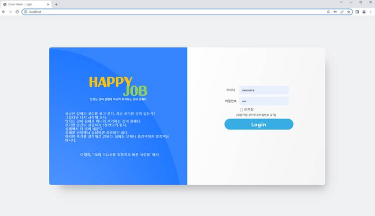

# ✅ 프로젝트 환경세팅

> 전자정부표준 프레임워크(eGovFramework)로 제작된 프로젝트를 로컬에 세팅하기

프로젝트 세팅 및 초기 데이터 INSERT

초기 데이터(init_data_emp.xlsx) 작성 모두 끝난 팀은, eXERD 에서 본인들 ERP켜고 오른쪽 모델 부분에 ERD 그림 반영 안된 항목 있는지 더블클릭해서 확인(중복된 항목 있으면 삭제)

 

< NAS (*Network Attached Storage*, 네트워크 결합 스토리지) >

네트워크 드라이브 연결하는 작업(노트북 사용해서 프로젝트 진행할 사람들 참조)

[파일 탐색기] 열어서 화면 최상단 경로에 [\\DESKTOP-40KHJBQ](file://DESKTOP-40KHJBQ) 붙여넣기

`/sharefolder` 마우스 오른쪽 [네트워크 연결] 클릭 > `W:` 입력

이 작업을 진행하는 이유는, 각자의 로컬PC에서 업로드하는 파일들이 전부  `/shareholder` 에 올라가 공유될 수 있도록 세팅하는 것

(0609~0610 파일관리 기능 필기 참조)

**D드라이브에 egov 폴더가 있다면, 별도의 추가 작업 필요없음**

 

<DB 작업을 위한 환경세팅>

D드라이브에

mysql-connector-java-5.0.8-bin.zip 파일 다운로드 및 압축풀기 ~

압축풀기 결과, mysql-connector-java-5.0.8-bin.jar 생성되면 이 상태로 스테이

 

<eXERD 포워드 엔지니어링 : PM업무>

기타 – 코멘트 생성 체크O ~ 다음 ~ 테이블 ~ 

 

<DB에 초기데이터 밀어넣기>

Toad 켜기 ~ Tool ~ Import ~ Add File ~ 만들어놓은 Excel 파일 선택(이 작업할 때 엑셀파일이 켜져 있으면 안됨) ~ Tables 에서 어떤 테이블에 밀어넣을 것인지 대상 테이블 선택 ~ 아래 By name 선택하면 이름이 똑같은 칼럼끼리 매핑해서 데이터를 넣어줌

 

---

<프로젝트 환경세팅>

 

0) 이클립스 실행(egov – 3.6 – 이클립스 런)

 

1) 왼쪽에 Navigator 창에 생성된 여러 프로젝트 중에 Servers 라고 적힌거 빼고 다 삭제

(Delete project components on disk 체크하고 전부 삭제)

 

2) Window – Show View – Other 안에 SVN – SVN Repositories 클릭하고 OK

이클립스 화면 하단에 SVN Repositories 탭 내부에 들어있는 항목 전부 삭제

 

3) SVN 연결해서 소스 내려받기

각자의 SVN URL 주소 복사

이클립스 화면 하단에 SVN Repositories 탭 내부에 마우스 오른쪽 – New – 레파지토리 로케이션 – URL 에 복사한 링크 붙여넣기 – save auth 클릭 – 본인 아이디/비번 넣고 생성

이클립스 화면 하단에 SVN Repositories 탭 내부에 한줄 생긴 항목 클릭 – newdeal4erp 마우스 오른쪽 클릭 – Check Out 클릭

여기까지하면 왼쪽 Project Explorer 창에 프로젝트 진행에 필요한 프레임워크가 전부 세팅되어 있음 (소스 내려받기 완료)

Navigator 창에 새로 생성된 파일 오른쪽버튼 -> Maven -> update project -> Force Update of Snapshots/Releases 체크박스 누르고 OK

(Maven 은 프로젝트에서 쓰는 제3자 라이브러리들을 우리 프로젝트 소스/프레임워크에 묶어줌, 본 문서 하단에서 조금 더 자세히 설명)

 

+) 노트북 사용하는 사람들은 이클립스가 서버를 못찾는 문제 있으니 해결

Window – Preferences – Server – Server Runtime Environments 에서 환경세팅!

 

4) 서버 Run 작업

이클립스 화면 하단에 Servers 탭 클릭하고 기존 서버 파일 다 지움

같은 창에서 마우스 오른쪽 New – Server – 톰캣 8.0 클릭 – Server name 에 newdeal4erp 입력 - Next> 클릭 - Available: 탭에 뜬 newdeal4erp 항목을 오른쪽 Configured: 탭으로 Add> 한 다음 Finish

방금 만든 서버 더블클릭 ~ 상단에 뜬 화면에서 Overview 탭 누르고 Ports 영역에 HTTP/1.1 에 Port Number 8080 인 부분을 80 으로 수정하고 저장(ctrl + s)

Overview 탭 오른쪽 Modules 탭 누르고 Path /www 라고 적혀 있으니, 이 부분 클릭하고 Edit… ~ /www 에서 www 지우고 / 만 남겨서 저장(ctrl + s)

Overview 탭 오른쪽 Modules 탭 누르고 Add External Web Module... 클릭하고 
- Document Base 에 W:\FileRepository 입력, Path 에 /serverfile 입력하고 OK 클릭 ~ 저장(ctrl + s)

화면 하단에 서버 항목 누르고 마우스 오른쪽 ~ **Clean** **클릭**

화면 하단에 서버 항목 누르고 start 클릭하면 서버 Run

(혹은 서버 탭에서 원하는 서버 항목 누른 상태에서 초록색 재생 아이콘▶ 클릭)

 

서버가 정상적으로 Run 되면 Console 탭에 아래와 같은 로그 뜸

(필기 참조)

마지막 작업! 크롬켜서 주소창에 localhost 입력하면 아래와 같은 화면 뜨는지 확인!

이 상태에서 초기데이터로 밀어넣은 사용자정보 데이터 아무거나 골라서 아이디, 비밀번호 넣고 로그인 되는지 확인하면 진짜 끝 

---

 

💡Maven 이란?

프로젝트 파일 – Properties – Java Build Path – Libraries - Maven 눌러보면, 프로젝트에서 쓰려는 제3자 라이브러리가 전부 들어와서 프로젝트에 묶여 있는 것을 볼 수 있음

(옛날에는 이런 자료파일 하나하나 구글링으로 찾아서 Add External JARs.. 로 전부 끼워넣었음)

프로젝트 폴더에서 pom.xml 보면, dependency 에 적혀있던 항목이 전부 있음

 

Maven – Update Project 작업은 무엇인가?

외부(https://mvnrepository.com/)에서 받아옴
