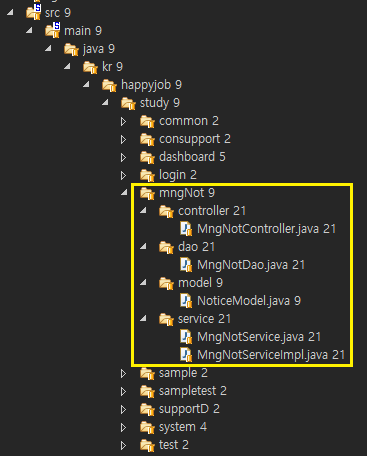
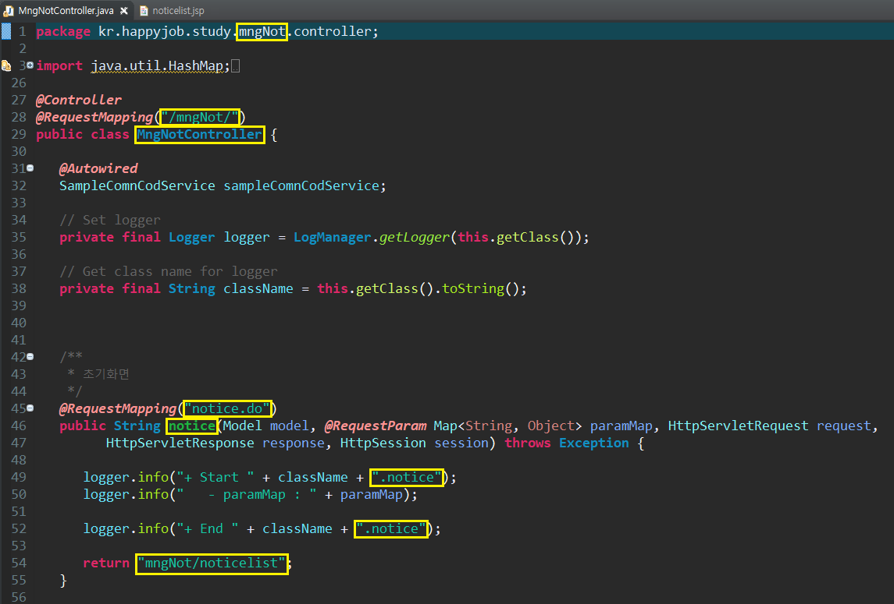
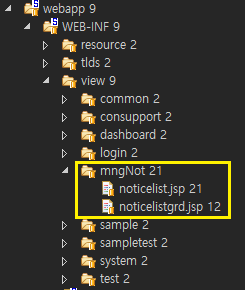

# ✅ CRUD - I

> - 학습목표 : 전자정부표준 프레임워크(eGovFramework)로 제작된 프로젝트에서 CRUD 구현하는 로직을 배움
>
> 1. 개발순서 개요
> 2. 게시글 CRUD
> 3. 파일 CRUD
>
> 💡(본 문서는 개발순서 개요, 화면 URL 연결, 그리고 게시글 CRUD - READ 까지만 작성, 나머지 게시글 CUD 와 파일  CRUD 는 다음 문서인 CRUD - II, CRUD - III 에서 다룸)


## 1. 개발순서 개요

> 아래 로직에 따라 JSP(jQuery, JSTL), SQL, Spring Framework 를 다룸


#### 1-1. 화면 URL 연결

#### 1-2. CRUD

1-2-1. 글/파일 목록조회 (**R**EAD)

1-2-2. 글/파일 등록 (**C**REATE)

1-2-3. 글/파일 수정 (**U**PDATE)

1-2-4. 글/파일 삭제 (**D**ELETE)


---


## 2. 게시글 CRUD

> [공지사항] 기능 구현을 예시로, 게시글 CRUD 로직 정리 


#### 2-1. 화면 URL 연결

- 기본원리 : [공지사항] 화면에서 보여줄 HTML 을 연결해주는 작업

- 세부원리 : [공지사항] 화면 URL http://localhost/mngNot/notice.do 에서 /mngNot/notice.do 부분을 Java단(Controller)과 JSP단으로 받아오는 작업

- 작업순서

  - Java단

    - 디렉토리 구조

      

    - Navigator 탭 `/src/main/java/kr/happyjob/study` 에서 마우스 오른쪽 New 누르고 `/mngNot` 폴더 생성

    - `/mngNot` 과 같은 단에 있는 `/sample`  폴더에서 4개 하위 폴더들(`/controller`, `/dao`, `/model`, `/service`) 복사하고 `/mngNot` 내부에 붙여넣기

    - `/mngNot/controller` 내부에 복붙되어 있는 `.java` 파일명과 해당 파일 내부  public class 이름,  @RequestMapping 영역을 구현하려는 화면에 맞춰서 수정

      


  - JSP단

    - 디렉토리 구조

      

    - Navigator 탭 `/src/main/webapp/WEB-INF/view` 에서 마우스 오른쪽 New 누르고 `/mngNot` 폴더 생성

    - `/view/mngNot` 내부에 `noticelist.jsp` 파일 생성 (`/view/sample/sample_comncod.jsp` 내부 코드 복붙하고 파일명만 일단 고쳐놓기)

  - Java단

    - `/mngNot/controller`  내부 `MngNotController.java` 파일로 돌아가서, @RequestMapping 하단 return 값을 새로 생성한 JSP 파일명(`/mngNot/noticelist`)으로 변경 


#### 2-2. CRUD

> 💡Flow : 컨트롤러(`Controller.java`) ➡️ 서비스(`Service.java`) ➡️ 다오(`Dao.java`) ➡️ SQL(`Mapper.xml`)


2-2-1. READ

- JSP단 (`/view/mngNot/noticelist.jsp`)

  > `<script>` 내부 JS 코드 정리하는 작업

  - Pagination 구현을 위한 준비

    - JS 코드 최상단에 한 페이지당 레코드 몇 개 보여줄 것인지 기능하는 변수(pageSize), 페이지네이션 항목 몇 개 생성할 것인지 기능하는 변수(pageBlockSize)  선언

      ```javascript
      // 페이징 설정
      var pageSize = 10;     
      var pageBlockSize = 5;    
      ```

  - `function fRegisterButtonClickEvent()` 

    - `sample_comncod.jsp`  에 작성되어 있던 버튼 이벤트 함수

    - 함수 내부 `e.preventDefault()` 코드는 지금까지 이벤트에 누적된 실행조건을 전부 취소하라는 의미

  - Onload event

    - Onload event 는 브라우저에 HTML 뿌린 직후의 상태를 의미. 아래와 같이 화면 Onload 시, 버튼 이벤트 등록 함수(`fRegisterButtonClickEvent()`) 와  게시글 목록조회 함수(`fn_noticelist()`) 실행될 수 있도록 코드 채우기

      ```javascript
      /** OnLoad event */ 
      $(function() {
          // 버튼 이벤트 등록
          fRegisterButtonClickEvent();
          // 코드 하단에서 선언할 function fn_noticelist() 도 Onload 에 미리 적어주기
          fn_noticelist();
      });
      ```

  - `function fn_noticelist()` 선언

    - JSP 와 Controller 가 커뮤니케이션할 수 있도록 Ajax 를 활용하는데, 지금 우리가 쓰는 프로젝트에 `/src/main/webapp/WEB-INF/resource/js/commonAjax.js` 파일 안에 이런 커뮤니케이션 작업을 위해 공통모듈 만들어 놓은게 있음
    - `/js/commonAjax.js` 에서 function callAjax 코드 첫 줄(`callAjax(url, method, dataType, async, param, callback)`) 복사해서 `function fn_noticelist()` 최하단에 붙여넣고, 화면 구현에 필요한 양식으로 커스텀하기

      ```javascript
      function fn_noticelist(pagenum) {
      
          pagenum = pagenum || 1;
      
          var param = {
              delyn : $("#delyn").val()
              ,	searchKey : $("#searchKey").val()
              , 	sname : $("#sname").val()
              , pageSize : pageSize
              , pageBlockSize : pageBlockSize
              , pagenum : pagenum
          }
      
          var listcollabck = function(returnvalue) {
              console.log(returnvalue);
      
              $("#listnotice").empty().append(returnvalue);
      
              var  totalcnt = $("#totalcnt").val();
      
              console.log("totalcnt : " + totalcnt);
      
              var paginationHtml = getPaginationHtml(pagenum, totalcnt, pageSize, pageBlockSize, 'fn_noticelist');
              console.log("paginationHtml : " + paginationHtml);
      
              $("#noticePagination").empty().append( paginationHtml );
      
          }
      
          callAjax("/mngNot/noticelist.do", "post", "text", false, param, listcollabck);
      
      }
      ```

- Java 단 - Controller (`/mngNot/controller/MngNotController.java`)

  - @RequestMapping("noticelist.do") 부분 신규 작성
  
    - Pagination 기능은 SQL문에서 LIMIT 메서드(MySQL 에만 있음) 활용
    - 예를 들어 LIMIT 0, 10 은 0부터 10까지 레코드 뽑아옴
    - 아래와 같은 규칙을 `int pageindex = (pagenum - 1) * pageSize;` 이렇게 컨트롤러 파일에 코드로 반영
  
      |                     | Query (MySQL) | Logic (`pageindex `)           |
      | ------------------- | ------------- | ------------------------------ |
      | 1 page              | LIMIT 0, 10   | [(1-1)*10 부터 10까지]         |
      | 2 page              | LIMIT 10, 20  | [(2-1)*10 부터 20까지]         |
      | 3 page              | LIMIT 20, 30  | [(3-1)*10 부터 30까지]         |
      | N (`pagenum `) page | ...           | [(N-1)*10 부터 `pageSize`까지] |
  
    ```java
    @RequestMapping("noticelist.do")
       public String noticelist(Model model, @RequestParam Map<String, Object> paramMap, HttpServletRequest request,
             HttpServletResponse response, HttpSession session) throws Exception {
          
          logger.info("+ Start " + className + ".noticelist");
          logger.info("   - paramMap : " + paramMap);
          
          // 페이지네이션 로직 구현
          int pagenum = Integer.parseInt((String) paramMap.get("pagenum"));
          int pageSize = Integer.parseInt((String) paramMap.get("pageSize"));
          int pageindex = (pagenum - 1) * pageSize;
          
          paramMap.put("pageSize", pageSize);
          paramMap.put("pageindex", pageindex);
          
          // Controller  Service  Dao  SQL
          List<NoticeModel> noticesearchlist = mngNotService.noticelist(paramMap);
          int totalcnt = mngNotService.countnoticelist(paramMap);
          
          model.addAttribute("noticesearchlist", noticesearchlist);
          model.addAttribute("totalcnt", totalcnt);
          
          logger.info("+ End " + className + ".noticelist");
    
          return "mngNot/noticelistgrd";
       }
       
    }
    ```
  
- Java 단 - Model (`/mngNot/model/NoticeModel.java`)

  - SELECT문으로 뽑은 데이터를 담을 그릇(**VO모델**) 만드는 작업

  - Controller 에서 줄줄이 조회한 것을 모델에 담아서 JSP 에 던지는 원리

  - 이 파일에서 private 으로 선언된 함수들은 특정 클래스 내부에서만 접근이 가능. 따라서 외부에서 상속값으로 참조할 수 있게 하려면 public 으로 선언해야 함

  - 우선 `/study/system/model/NoticeModel.java` 파일을 복붙하고 코드 구조 살펴보기

  - 화면에서 활용하려는 데이터 컬럼명와 자료형을 복붙해온 `NoticeModel.java` 파일에 명시적으로 입력 > 모델로 생성하려는 부분만 드래그 > Eclipse IDE 상단 Source 클릭 > Generate Getters and Setters... 클릭하면 자동으로 모델 생성

    ```java
    package kr.happyjob.study.mngNot.model;
    
    public class NoticeModel {
    
    	public String getNotice_del_yn() {
    		return notice_del_yn;
    	}
    	public void setNotice_del_yn(String notice_del_yn) {
    		this.notice_del_yn = notice_del_yn;
    	}
    	public String getLoginID() {
    		return loginID;
    	}
    	public void setLoginID(String loginID) {
    		this.loginID = loginID;
    	}
    	public int getNotice_no() {
    		return notice_no;
    	}
    	public void setNotice_no(int notice_no) {
    		this.notice_no = notice_no;
    	}
    	public String getNotice_title() {
    		return notice_title;
    	}
    	public void setNotice_title(String notice_title) {
    		this.notice_title = notice_title;
    	}
    	public String getNotice_date() {
    		return notice_date;
    	}
    	public void setNotice_date(String notice_date) {
    		this.notice_date = notice_date;
    	}
    	public String getNotice_cont() {
    		return notice_cont;
    	}
    	public void setNotice_cont(String notice_cont) {
    		this.notice_cont = notice_cont;
    	}
    	public int getFile_no() {
    		return file_no;
    	}
    	public void setFile_no(int file_no) {
    		this.file_no = file_no;
    	}
    	public String getFile_name() {
    		return file_name;
    	}
    	public void setFile_name(String file_name) {
    		this.file_name = file_name;
    	}
    	public String getLogic_path() {
    		return logic_path;
    	}
    	public void setLogic_path(String logic_path) {
    		this.logic_path = logic_path;
    	}
    	public String getPhysic_path() {
    		return physic_path;
    	}
    	public void setPhysic_path(String physic_path) {
    		this.physic_path = physic_path;
    	}
    	public int getFile_size() {
    		return file_size;
    	}
    	public void setFile_size(int file_size) {
    		this.file_size = file_size;
    	}
    	public String getExten() {
    		return exten;
    	}
    	public void setExten(String exten) {
    		this.exten = exten;
    	}
    	public String getName() {
    		return name;
    	}
    	public void setName(String name) {
    		this.name = name;
    	}
    	private String notice_del_yn;
    	private String loginID;
    	private int notice_no;
    	private String notice_title;
    	private String notice_date;
    	private String notice_cont;
    	private int file_no;
    	private String file_name;
    	private String logic_path;
    	private String physic_path;
    	private int file_size;
    	private String exten;
    	private String name;
    ```

- Java 단 - Service (`/mngNot/service/MngNotService.java `)

  - Service 파일명, 내부 소스코드 수정

    ```java
    package kr.happyjob.study.mngNot.service;
    
    import java.util.List;
    import java.util.Map;
    
    import kr.happyjob.study.mngNot.model.NoticeModel;
    import kr.happyjob.study.system.model.ComnCodUtilModel;
    import kr.happyjob.study.system.model.ComnDtlCodModel;
    import kr.happyjob.study.system.model.ComnGrpCodModel;
    
    public interface MngNotService {
    
    	/**  목록 조회 */
    	public List<NoticeModel> noticelist(Map<String, Object> paramMap) throws Exception;
    	
    	/** 목록 카운트 조회 */
    	public int countnoticelist(Map<String, Object> paramMap) throws Exception;
    	
    }
    ```

  - Java 단 - Controller (`/mngNot/controller/MngNotController.java`)

    - 다시 Controller 파일로 돌아가서 @Controller 바로 윗 부분에 아래와 같이 모델, 서비스 import

    - `public class MngNotController` 내부에 @Autowired (클래스를 전역변수로 만들어주는 효과) 작성

      ```java
      import kr.happyjob.study.mngNot.model.NoticeModel;
      import kr.happyjob.study.mngNot.service.MngNotService;
      
      @Controller
      @RequestMapping("/mngNot/")
      public class MngNotController {
         
         @Autowired
         MngNotService mngNotService;
      
          // Set logger
         private final Logger logger = LogManager.getLogger(this.getClass());
      
         // Get class name for logger
         private final String className = this.getClass().toString();
         
         ...
      ```

 - Java 단 - Impl (`/mngNot/service/MngNotServiceImpl.java`)

    - 내가 작성한 클래스의 비전이 어디인지 선언해주는 작업

    - @Service : 여기가 서비스라고 스프링 프레임워크에게 알려주는 것

    - 다음단계에서 작성할 Dao 파일과 연결되도록 

      `@Autowired
      	MngNotDao mngNotDao;` 작성

      ```java
      package kr.happyjob.study.mngNot.service;
      
      import java.util.List;
      import java.util.Map;
      
      import org.apache.log4j.LogManager;
      import org.apache.log4j.Logger;
      import org.springframework.beans.factory.annotation.Autowired;
      import org.springframework.stereotype.Service;
      
      import kr.happyjob.study.mngNot.dao.MngNotDao;
      import kr.happyjob.study.mngNot.model.NoticeModel;
      
      
      @Service
      public class MngNotServiceImpl implements MngNotService {
      
      	// Set logger
      	private final Logger logger = LogManager.getLogger(this.getClass());
      	
      	// Get class name for logger
      	private final String className = this.getClass().toString();
      	
      	@Autowired
      	MngNotDao mngNotDao;
      	
      	/** 목록 조회 */
      	public List<NoticeModel> noticelist(Map<String, Object> paramMap) throws Exception {
      		
      		return mngNotDao.noticelist(paramMap);
      	}
      	
      	/** 목록 카운트 조회 */
      	public int countnoticelist(Map<String, Object> paramMap) throws Exception {
      				
      		return mngNotDao.countnoticelist(paramMap);
      	}
      	
      }
      
      ```

  - Java 단 - Dao (`/mngNot/dao/MngNotDao.java`)

    - `public interface MngNotDao` 내부에 적어주는 초기 세팅코드는 서비스의 경우와 동일

      ```java
      package kr.happyjob.study.mngNot.dao;
      
      import java.util.List;
      import java.util.Map;
      
      import kr.happyjob.study.mngNot.model.NoticeModel;
      
      public interface MngNotDao {
      
      	/**  목록 조회 */
      	public List<NoticeModel> noticelist(Map<String, Object> paramMap) throws Exception;
      	
      	/** 목록 카운트 조회 */
      	public int countnoticelist(Map<String, Object> paramMap) throws Exception;
      	
      }
      ```

  - SQL 단 (`/src/main/resources/sql/MngNot/MngNotMapper.xml`)

    - 소스코드 파일 최상단 `<mapper>` namespace 에 아래와 같이 MngNotDao 찾아가도록 경로 맞춤
    
      ```xml
      <?xml version="1.0" encoding="UTF-8"?>
      <!DOCTYPE mapper PUBLIC "-//mybatis.org//DTD Mapper 3.0//EN" "http://mybatis.org/dtd/mybatis-3-mapper.dtd">
      
      <mapper namespace="kr.happyjob.study.mngNot.dao.MngNotDao">
      ```
    
    - 게시글 목록조회하는 `<SELECT>`에 id (`noticelist`) 넣고, resultType 도 `NoticeModel` 찾아갈 수 있께끔 변경
    
    - Toad 활용하여 SQL 쿼리문 작성. 쿼리문이 완성되면 복사해서 `<SELECT>` 내부에 복붙
    
    - WHERE절은 Mybatis 문법 `<where>` , `<if>` , `<choose>` , `<otherwise>` 활용하여 작성
    
      ```xml
      <!--  목록 조회 -->
      <select id="noticelist" resultType="kr.happyjob.study.mngNot.model.NoticeModel">
          /*kr.happyjob.study.mngNot.dao.MngNotDao.noticelist*/
          select nt.notice_del_yn
          ,nt.loginID
          ,nt.notice_no
          ,nt.notice_title
          ,nt.notice_date
          ,nt.notice_cont
          ,nt.file_no
          ,fi.file_name
          ,fi.logic_path
          ,fi.physic_path
          ,fi.file_size
          ,fi.exten
          ,ui.name
          from tb_notice nt
          inner join tb_userinfo ui on ui.loginID = nt.loginID
          left outer join tb_file fi on fi.file_no = nt.file_no       
          <where>
              <if test="(delyn != null) and (!delyn.equals(''))">
                  and nt.notice_del_yn = #{delyn}
              </if>
              <if test="(sname != null) and (!sname.equals(''))">
                  <choose>
                      <when
                            test="searchKey eq 'writer'.toString()">
                          and ui.name Like CONCAT('%', #{sname}, '%')
                      </when>
                      <when
                            test="searchKey eq 'title'.toString()">
                          and nt.notice_title LIKE CONCAT('%', #{sname}, '%')
                      </when>
                      <otherwise>
                          and (   ui.name Like CONCAT('%', #{sname}, '%')
                          or nt.notice_title LIKE CONCAT('%', #{sname}, '%')
                          )
                      </otherwise>
                  </choose>
              </if>		
          </where>		
          ORDER BY nt.notice_date DESC
          LIMIT #{pageindex}, #{pageSize}
      
      </select>
      ```
    
    - 참고로 `Mapper.xml` 파일을 외부에서 복사해서 프로젝트 폴더에 가져오거나, 기존에 존재하던 `Mapper.xml` 파일 내용을 수정하는 경우, 톰캣이 자동으로 컴파일하지 못하기 때문에 Eclipse IDE 에서 **수동(강제) 컴파일** 작업을 해줘야함
    
      > Eclipse IDE 상단 Project 클릭 > Clean 클릭
      >
      > Eclipse IDE 하단 Server 탭 항목 마우스 오른쪽 > Clean > Server Run (여긴 컴파일 상황을 서버에 반영하는 단계)
    
  - Java 단 - Controller (`/mngNot/controller/MngNotController.java`)
  
    - 마지막, 데이터 뿌려주기 작업단계
    - Controller 파일 내 `public String noticelist` 에서 `return "mngNot/noticelist";` 을 `return "mngNot/noticelistgrd";` 로 변경

- JSP단 (`/view/mngNot/noticelistgrd.jsp`)
  - `noticelist.jsp` 와 같은 폴더에 `noticelistgrd.jsp` 파일 생성 (`/system/comGrdCodeList.jsp` 복붙하고, 조건에 맞게 파일내용 수정)


### 🗂️ [CRUD - READ 구현된 최종 소스코드 확인](../practices/0608_CRUD_READ)