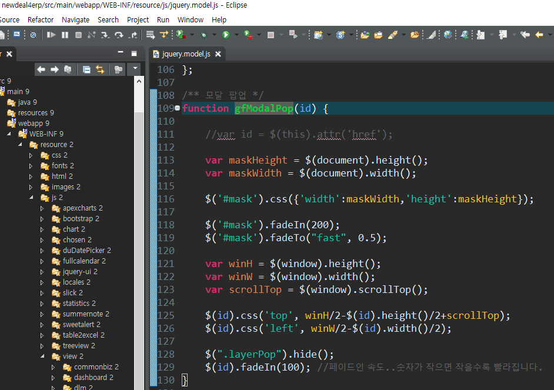

# ✅ CRUD - II

> - 학습목표 : 전자정부표준 프레임워크(eGovFramework)로 제작된 프로젝트에서 CRUD 구현하는 로직을 배움
>
> 1. 개발순서 개요
> 2. 게시글 CRUD
> 3. 파일 CRUD
>
> 💡(본 문서는 게시글 CRUD - CREATE, UPDATE, DELETE 까지만 작성, 나머지 파일  CRUD 는 다음 문서인 CRUD - III 에서 다룸)


2-2-2. CREATE

- JSP단 (`/view/mngNot/noticelist.jsp`)

  >  CREATE, UPDATE, DELETE 기능 구현을 위해, 팝업창 먼저 다듬어 놓기

  - JSP 파일에서 [신규등록] 버튼 href 에 커스텀 제작할 function name 입력

    ```jsp
    <a class="btnType blue" href="javascript:fn_openpopup();" name="modal"><span>신규등록</span></a>
    ```

  - 같은 파일 `<script>` 에 `function fn_openpopup()` 새로 작성

    - 기본 골격은 프로젝트 내에 미리 만들어진 `function gfModalPop()` 참조

      

  - Toad 켜서 CREATE 작업결과 어떤 테이블의, 어떤 컬럼을 채우게 될 것인지 키워드 미리 정리

  - JSP 파일에서 팝업될 모달창 부분에 `<tbody>` 내부를 보여주고 싶은대로 수정

    - 하위 태그의 id, name 도 구현하고 있는 값에 맞게 수정

      ```jsp
      <tbody>
          <tr>
              <th scope="row">제목 <span class="font_red">*</span></th>
              <td colspan="3"><input type="text" class="inputTxt p100" name="notice_title" id="notice_title" /></td>
          </tr>
          <tr>
              <th scope="row">내용 <span class="font_red">*</span></th>
              <td colspan="3">
                  <textarea id="notice_cont" name="notice_cont"> </textarea>
              </td>
          </tr>
      </tbody>
      ```

  - 버튼 기능하는 `<div>` , `<a>` id 도 전부 수정

    ```jsp
    <div class="btn_areaC mt30">
        <a href="" class="btnType blue" id="btnSave" name="btn"><span>저장</span></a> 
        <a href="" class="btnType blue" id="btnDelete" name="btn"><span>삭제</span></a> 
        <a href=""	class="btnType gray"  id="btnClose" name="btn"><span>취소</span></a>
    </div>
    ```

  - `<script>` 버튼 이벤트 관리하는 코드도 조건에 맞게 수정

    ```javascript
    /** 버튼 이벤트 등록 */
    
    function fRegisterButtonClickEvent() {
        $('a[name=btn]').click(function(e) {
            e.preventDefault();
    
            var btnId = $(this).attr('id');
    
            switch (btnId) {
                case 'btnSearch' :
                    fn_noticelist();
                    break;
                case 'btnSave' :
                    fn_save();
                    break;	
                case 'btnDelete' :
                    $("#action").val("D");	
                    fn_save();
                    break;	
                case 'btnClose' :
                case 'btnCloseDtlCod' :
                    gfCloseModal();
                    break;
            }
        });
    }
    ```

  - [신규등록] 모달창이므로 화면 초기화 로직을 구현해야하고, [삭제] 버튼 숨김처리도 진행

    - 화면 초기화 로직은 `function fn_openpopup()` 내부에 `popupinit();` 작성해놓고, 바깥 단에 `function popupinit(object)` 새로 작성 (제이쿼리 문법 활용해서 팝업창 초기화 로직 추가)
    
      ```javascript
      function fn_openpopup() {
      		
          popupinit();
      
          // 모달 팝업
          gfModalPop("#layer1");
      
      }
      ```
    
      ```javascript
      function popupinit(object) {
      		
          if(object == "" || object == null || object == undefined) {
              $("#notice_title").val("");		
              $("#notice_cont").val("");
              $("#notice_no").val("");
      
              $("#btnDelete").hide();
      
              // object 가 없는 상태로 팝업 뜰 땐, action 을 “I” 로 설정하여  INSERT
              $("#action").val("I");	
          } else {
              $("#notice_title").val(object.notice_title);		
              $("#notice_cont").val(object.notice_cont);
              $("#notice_no").val(object.notice_no);
      
              $("#btnDelete").show();
      
              // object 가 있는 상태로 팝업 뜰 땐, action 을 “U” 로 설정하여  UPDATE
              $("#action").val("U");	
          }
      }
      ```
    
    - [삭제] 버튼 id는 btnDelete 로 줬는데, 초기화된 팝업창(신규등록)에서 삭제 기능은 필요 없으니까 `function popupinit()` 안에 `$("#btnDelete").hide();` 입력하여 화면에서 숨김 처리
    
    - 동일한 팝업창을 활용하여 [신규등록], [수정] 기능을 동시에 구현하기위해, JSP 파일 `<form>` 내부 최상단에 hidden 만들기 
    
      > `id="action"` 은 `$("#action").val("I");` , `$("#action").val("U");	` 과 같이 제이쿼리로 활용하기 위해 기입
      >
      > `name="action"` 은 추후 `.serialize() ` 활용하기 위해 미리 기입한 것, `.serialize()` 는 `<form>` 이하 단에 name 값을 명시적으로 입력한 데이터들만 한꺼번에 다룰 수 있게 도와주는  매서드 (파라미터 선언 과정에서 전달할 요소가 너무 많아서 하나씩 입력하기 힘들 때 활용)
    
      ```jsp
      <body>
      <form id="myForm" action=""  method="">
      	<input type="hidden" id="action"  name="action"  />
          ...
      ```


---


2-2-3. UPDATE & DELETE

> 게시글 목록에서 제목을 클릭했을 때, 한건 조회(글 상세페이지 팝업) 가능하도록 기능 구현
>
> 같은 팝업창에서 UPDATE & DELETE 기능 모두 구현

- JSP단 (`/view/mngNot/noticelistgrd.jsp`)

  - [제목] 을 보여주는 `<tb>` 내부 `<a>` href 를 아래와 같이 수정

    ```jsp
    <td>
        <a href="javascript:fn_selectone('${list.notice_no}')">${list.notice_title}</a>
    </td>
    ```

- JSP단 (`/view/mngNot/noticelist.jsp`)

  - `function fn_selectone(no)` 작성

    ```javascript
    function fn_selectone(no) {
    		
        //alert(no);
    
        var param = {
            notice_no : no
        }
    
        var selectoncallback = function(returndata) {			
            
            // json은 로그 찍어보면 이상한 상태로 던져지고 있으니까 stringfy 작업 필수
            console.log( JSON.stringify(returndata) );
    
            popupinit(returndata.noticesearch);
    
            // 모달 팝업
            gfModalPop("#layer1");
    
        }
    
        callAjax("/mngNot/noticeselectone.do", "post", "json", false, param, selectoncallback) ;
    
    }
    ```

- Java 단 - Controller (`/mngNot/controller/MngNotController.java`)

  - @RequestMapping(“noticeselectone.do”) 작성

    - http 응답의 바디 영역에 HTML 이 아니라 데이터(json) 넘길 땐, @ResponseBody 사용

    - Map 데이터는 초기화할 때 HashMap 써야 됨, Map 의 사촌 개념

      ```java
      @RequestMapping("noticeselectone.do")
      @ResponseBody
      public Map<String, Object> noticeselectone(Model model, @RequestParam Map<String, Object> paramMap, HttpServletRequest request,
                                                 HttpServletResponse response, HttpSession session) throws Exception {
      
          logger.info("+ Start " + className + ".noticeselectone");
          logger.info("   - paramMap : " + paramMap);
      
          // Controller  Service  Dao  SQL
          NoticeModel noticesearch = mngNotService.noticeselectone(paramMap);
      
          Map<String, Object> returnmap = new HashMap<String, Object>();
      
          returnmap.put("noticesearch", noticesearch);
      
          logger.info("+ End " + className + ".noticeselectone");
      
          return returnmap;
      }   
      ```

- 이제 컨트롤러 파일에 작성된 내용 바탕으로 메서드 만들기 (서비스 파일 작성)

  - `/mngNot/service/MngNotService.java`

    ```java
    public interface MngNotService {
    
        ...
        
        /** 한건 조회 */
        public NoticeModel noticeselectone(Map<String, Object> paramMap) throws Exception;
        
        ...
    
    }
    ```

  - `/mngNot/dao/MngNotDao.java`

    ```java
    public interface MngNotDao {
    
    	...
    	
    	/** 한건 조회 */
    	public NoticeModel noticeselectone(Map<String, Object> paramMap) throws Exception;
    	
    	...
            
    }
    ```

  - `/mngNot/service/MngNotServiceImpl.java`

    ```java
    @Service
    public class MngNotServiceImpl implements MngNotService {
    
    	// Set logger
    	private final Logger logger = LogManager.getLogger(this.getClass());
    	
    	// Get class name for logger
    	private final String className = this.getClass().toString();
    	
    	@Autowired
    	MngNotDao mngNotDao;
    	
    	...
    	
    	/** 한건 조회 */
    	public NoticeModel noticeselectone(Map<String, Object> paramMap) throws Exception {
    		
    		return mngNotDao.noticeselectone(paramMap);
    	}
        
    }
    ```

- SQL 단 (`/src/main/resources/sql/MngNot/MngNotMapper.xml`)

  - 위 Java 단까지 작성한 코드를 바탕으로, 새로운 `<SELECT>` 작성

    ```xml
    <select id="noticeselectone" resultType="kr.happyjob.study.mngNot.model.NoticeModel">
        select nt.notice_del_yn
        ,nt.loginID
        ,nt.notice_no
        ,nt.notice_title
        ,nt.notice_date
        ,nt.notice_cont
        ,nt.file_no
        ,fi.file_name
        ,fi.logic_path
        ,fi.physic_path
        ,fi.file_size
        ,fi.exten
        ,ui.name
        from tb_notice nt
        inner join tb_userinfo ui on ui.loginID = nt.loginID
        left outer join tb_file fi on fi.file_no = nt.file_no  
        where nt.notice_no =  #{notice_no}               
    </select>
    ```

  - `Mapper.xml` 파일 수정했으니까, 컴파일하고 화면 확인하기

    - 이 때 콘솔창에 조건에 맞는 json 데이터 넘어오고 있는 것을 확인했다면 (json 안에 json 이 중첩된 형태), 이제 넘어온 데이터를 화면에 띄우는 작업만 남음

- JSP단 (`/view/mngNot/noticelist.jsp`)

  - [수정], [삭제] 의 경우 notice_no 를 PK로 갖는 게시글 데이터를 DB에서 가져와야 하기 때문에, JSP 파일 `<form>` 내부 최상단에 2번째 hidden 만들기 

    ```jsp
    <body>
    <form id="myForm" action=""  method="">
        ...
    	<input type="hidden" id="notice_no"  name="notice_no"  />
        ...
    ```

  - `function popupinit(object)` else문 내부에 새로 작성한 hidden (notice_no) 에 대해 코드 작성

  - [저장] 버튼(id=btnSave) 누르면 [신규등록], [수정] 기능 모두 작동하도록 `function fn_save()` 작성

    - 목록 조회할 때 제외하면 무조건 json 데이터가 오가니까, 데이터를 불러올 땐 무조건 param 선언 (`var param`)

    - 콜백함수 선언한 부분에 if조건문으로 "저장 되었습니다.", "오류가 발생 되었습니다." alrert 띄우는 코드 작성, 창을 닫고 목록 재조회하는 로직도 추가

      ```javascript
      function fn_save() {
      		
          if ( ! fn_Validate() ) {
              return;
          }
      
          var param = {
              action : $("#action").val(),
              notice_no : $("#notice_no").val(),
              notice_title : $("#notice_title").val(),
              notice_cont : $("#notice_cont").val()
          }
      
          var savecollback = function(reval) {
              console.log( JSON.stringify(reval) );
      
              if(reval.returncval > 0) {
                  alert("저장 되었습니다.");
                  gfCloseModal();
      
                  if($("#action").val() == "U") {
                      fn_noticelist($("#pageno").val());
                  } else {
                      fn_noticelist();
                  }
              }  else {
                  alert("오류가 발생 되었습니다.");				
              }
          }
      
          //callAjax("/mngNot/noticesave.do", "post", "json", false, param, savecollback) ;
          callAjax("/mngNot/noticesave.do", "post", "json", false, $("#myForm").serialize() , savecollback) ;
      
      }
      ```

- Java 단 - Controller (`/mngNot/controller/MngNotController.java`)

  - @RequestMapping(“noticesave.do”) 작성

    - 내부에 if 조건문으로 [신규등록] , [수정], [삭제] 한꺼번에 가능하도록 기능 구현

    - 로그인 정보를 넣어야 하니까, 로그인 컨트롤러에서 세션 관련 코드도 긁어와서 넣기

      ```java
      @RequestMapping("noticesave.do")
      @ResponseBody
      public Map<String, Object> noticesave(Model model, @RequestParam Map<String, Object> paramMap, HttpServletRequest request,
                                            HttpServletResponse response, HttpSession session) throws Exception {
      
          logger.info("+ Start " + className + ".noticesave");
          logger.info("   - paramMap : " + paramMap);
      
          String action = (String) paramMap.get("action");
      
          paramMap.put("loginid", (String) session.getAttribute("loginId"));
      
      
          int returncval = 0;
      
          if("I".equals(action)) {
              returncval = mngNotService.noticeinsert(paramMap);
          } else if("U".equals(action)) {
              returncval = mngNotService.noticeupdate(paramMap);
          } else if("D".equals(action)) {
              returncval = mngNotService.noticedelete(paramMap);
          }      
      
          Map<String, Object> returnmap = new HashMap<String, Object>();
      
          returnmap.put("returncval", returncval);
      
          logger.info("+ End " + className + ".noticesave");
      
          return returnmap;
      }    
      ```

- 위 Controller 변경 사항을 서비스, 다오, 임플에도 반영

  - `/mngNot/service/MngNotService.java`

    ```java
    public interface MngNotService {
    
    	...
    	
    	/** 등록 */
    	public int noticeinsert(Map<String, Object> paramMap) throws Exception;
    	
    	/** 수정 */
    	public int noticeupdate(Map<String, Object> paramMap) throws Exception;
    	
    	/** 삭제 */
    	public int noticedelete(Map<String, Object> paramMap) throws Exception;
    	
    }
    ```

  - `/mngNot/dao/MngNotDao.java`

    ```java
    public interface MngNotDao {
    
    	...
    	
    	/** 등록 */
    	public int noticeinsert(Map<String, Object> paramMap) throws Exception;
    	
    	/** 수정 */
    	public int noticeupdate(Map<String, Object> paramMap) throws Exception;
    	
    	/** 삭제 */
    	public int noticedelete(Map<String, Object> paramMap) throws Exception;
    }
    ```

  - `/mngNot/service/MngNotServiceImpl.java`

    ```java
    @Service
    public class MngNotServiceImpl implements MngNotService {
    
    	// Set logger
    	private final Logger logger = LogManager.getLogger(this.getClass());
    	
    	// Get class name for logger
    	private final String className = this.getClass().toString();
    	
    	@Autowired
    	MngNotDao mngNotDao;
    	
    	...
    	
    	/** 등록 */
    	public int noticeinsert(Map<String, Object> paramMap) throws Exception {
    		return mngNotDao.noticeinsert(paramMap);
    	}
    	
    	/** 수정 */
    	public int noticeupdate(Map<String, Object> paramMap) throws Exception {
    		return mngNotDao.noticeupdate(paramMap);
    	}
    	
    	/** 삭제 */
    	public int noticedelete(Map<String, Object> paramMap) throws Exception {
    		return mngNotDao.noticedelete(paramMap);
    	}
    	
    }
    ```

- SQL 단 (`/src/main/resources/sql/MngNot/MngNotMapper.xml`)

  - 위 Java 단까지 작성한 코드를 바탕으로, 새로운 `<INSERT>` 작성

    - `<selectkey>` 에서 `keyProperty=”no”` 로 작성한 것은, [마이바티스 문법에서 활용](https://velog.io/@cheshirehyun/SelectKey-%EC%82%AC%EC%9A%A9%ED%95%98%EA%B8%B0)하기 위함

    - Oracle 의 NVL 함수가 MySQL에서 ifnull 함수로 대체됨

      ```xml
      <insert id="noticeinsert">
          <selectKey resultType="int" keyProperty="no" order="BEFORE">
              select ifnull(max(notice_no),0) + 1 from tb_notice
          </selectKey>   
          insert into tb_notice
          (
          notice_no
          , notice_del_yn
          , loginID
          , notice_title
          , notice_cont
          , notice_date
          , file_no
          )
          values (
          #{no} 
          ,'N'
          ,#{loginid} 
          ,#{notice_title} 
          ,#{notice_cont} 
          ,now()
          ,0
          )
      </insert>
      ```

  - `<UPDATE>` 도 작성

    - 한건 조회 팝업창이 떴을 때, [저장] 버튼 클릭하면 수정한 데이터가 DB로 넘어가는 기능

      ```xml
      <update id="noticeupdate">
          update tb_notice
          set notice_title =  #{notice_title}   
          , notice_cont =  #{notice_cont}   
          , notice_date =  now()      
          where  notice_no =  #{notice_no}  
      </update>
      ```

  - `<DELETE>` 도 작성

    - 한건 조회 팝업창이 떴을 때, [삭제] 버튼 클릭하면 데이터가 DB에서 삭제되는 기능

    - 이 때, id 는 Controller 파일에서 가져온다는 사실에 유의

      ```xml
      <update id="noticedelete">
          update tb_notice
          set notice_del_yn =  'Y'
          where  notice_no =  #{notice_no}  
      </update>
      
      <delete id="noticedeleteold">
          delete from tb_notice
          where  notice_no =  #{notice_no}  
      </delete>
      ```

    - `/view/mngNot/noticelist.jsp` 에서 버튼 이벤트 등록을 위한 `function fRegisterButtonClickEvent()` case문도 아래와 같이 수정

      ```javascript
      function fRegisterButtonClickEvent() {
          $('a[name=btn]').click(function(e) {
              e.preventDefault();
      
              var btnId = $(this).attr('id');
      
              switch (btnId) {
                  case 'btnSearch' :
                      fn_noticelist();
                      break;
                  case 'btnSave' :
                      fn_save();
                      break;	
                  case 'btnDelete' :
                      $("#action").val("D");	
                      fn_save();
                      break;	
                  case 'btnClose' :
                  case 'btnCloseDtlCod' :
                      gfCloseModal();
                      break;
              }
          });
      }
      ```

- `Mapper.xml` 파일 수정했으니까, 컴파일하고 화면 확인하기


---


2-2-4. 추가적인 기능개선


**<페이지네이션 수정>**

위 상태에서는 특정 글을 수정했을 때, 수정한 게시글이 원래 있던 1페이지 자리에서 2페이지 자리로 넘어갈 수 있기 때문에 수정 완료하면 작업하던 현재 페이지를 보여줄 수 있게 수정

일단 noticelist.jsp 파일에서 3번째 hidden 을 작성. 현재 보고 있는 페이지 번호를 백업하는 곳. ` <input type="hidden" id="pageno" name="pageno" /> `

같은 파일 스크립트 영역에 var paginationHtml 에 $("#pageno").val(pagenum); 코드 추가하고,

var savecollback 부분 if문 안에 또 다른 if문 추가하여 수정 저장했을 때, #pageno 잘 가져오고 그렇지 않으면(else) fn_noticelist() 동작해서 공지사항의 디폴트 화면 보여주도록 코드 수정

 

<글 삭제되면 삭제여부 데이터 N 에서 Y 로 바꾸도록 수정>

.xml 파일에서 update 태그 추가해서 id=noticedelete 넣어서 작성

 

**<Validation 체크>**

위의 상태에서 제목, 내용을 비어있는 값으로 저장하면 공백 상태로 저장이 되어버림. 이런 문제를 해결하기 위해 noticelist.jsp function fn_save() 안에 유효성 검사하는 로직 추가하고 function fn_Validate() 작성 (같은 파일 내 validation 체크라는 주석으로 코드 ValidationGrpCode() 정리되어 있음 … 상위 로직은 common.js 파일 checkNotEmpty 에서 확인 가능)

 

**<$(“#myForm”).serialize()>**

`function fn_save()` 끝단에 callAjax("/mngNot/noticesave.do", "post", "json", false, param, savecollback) ; 부분 수정!  코드에서 param 부분을 $(“#myForm”).serialize() 로 고치기

이걸 쓰는 이유는 입력항목이 30~40개 될 때, var param 에 하나하나 안적어줘도 serialize() 로 똘똘 말아서 데이터 넘겨줄 수 있음 (사실 상 param 선언을 안써줘도 됨)

주의, `<form>` 태그 안에 name 안준 애들은 정보 안넘어감!


### 🗂️ [CRUD - CREATE, UPDATE, DELETE 구현된 최종 소스코드 확인](../practices/0609_CRUD_CUD)


