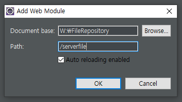

# ✅ CRUD - III

> - 학습목표 : 전자정부표준 프레임워크(eGovFramework)로 제작된 프로젝트에서 CRUD 구현하는 로직을 배움
>
> 1. 개발순서 개요
> 2. 게시글 CRUD
> 3. 파일 CRUD


## 3. 파일 CRUD

> 파일관리(upload, download)를 위한 기능구현


- UPDATE 기능구현 로직 (2X2 = 4가지 경우의 수 발생)

|                   | 수정파일O (파일B)       | 수정파일X |
| ----------------- | ----------------------- | --------- |
| 기존파일O (파일A) | 파일A 삭제 ➡️ 파일B 처리 | -         |
| 기존파일X         | 파일B 처리              | -         |


- 위 로직이 코드로는 아래와 같이 구현

  ```xml
  <if test="fileprc eq 'N'.toString()">
      ,#{notice_title} 
  </if>
  <if test="fileprc eq 'Y'.toString()">
      ,#{file_notice_title} 
  </if>
  <if test="fileprc eq 'N'.toString()">
      ,#{notice_cont} 
  </if>
  <if test="fileprc eq 'Y'.toString()">
      ,#{file_notice_cont} 
  </if>
  	               ,now()
  <if test="(fileprc eq 'N'.toString()) or (fileexist eq 'N'.toString()) ">
      ,0
  </if>
  <if test="(fileprc eq 'Y'.toString()) and (fileexist eq 'Y'.toString())">
      ,(select ifnull(max(file_no),0)  from tb_file)
  </if>
  
  ```

  

- INSERT 와 거의 비슷하지만, 위와 같이 4가지 경우의 수 고려하여 설계

  - 조건1 : 기존에 첨부된 파일이 있는지(기존파일O), 아닌지(기존파일X)

  - 조건2 : 수정 작업할 때 첨부된 파일이 있는지(수정파일O), 아닌지(수정파일X)

- [수정] 버튼 눌렀을 때, 데이터 1건조회 되는 기능 먼저 구현

  - 글번호 누르면 글상세 팝업이 뜨고, 글제목 누르면 파일상세 팝업이 뜨도록 JSP 파일 href 부분 먼저 수정

  - <script> 에서 function fn_selectonefile(no) 작성

    - popupinitfile() 로 초기화
    - function popupinitfile(object) else문 내부에($("#file_notice_title").val(object.notice_title); 윗부분) json 데이터로 받아오는 항목들 잡는 코드 작성
    - var inserthtml = “<a href='javascript:filedownload()'>”;
       inserthtml += “”;

       이 부분에 if문 넣어서 파일 이름이 없을 때(빈값, null, undefined) 예외처리하도록 하고
       var selfile, var selfilearr, var lastindex 그리고 그 아래 if/else 코드 가져와서 우리가 구현하고 있는 기능에 맞게 구분 (파일 확장자가 .sql 로 뽑히면 안되니까, 이걸 수정해주는 작업)

       Interthtml += “</a>”
    - 파일 미리보기를 위한 $("#previewdiv").empty().append(Interthtml); 입력$("#btnDeleteFile").show();
    - $("#action").val("U");
    
  - 여기까지 작업완료된 JSP 소스코드 `noticelist.jsp`
  
    ```jsp
    <%@ page language="java" contentType="text/html; charset=UTF-8"
    	pageEncoding="UTF-8"%>
    <%@ taglib prefix="c" uri="http://java.sun.com/jsp/jstl/core" %>
    
    <!DOCTYPE html>
    <html lang="ko">
    <head>
    <meta charset="UTF-8">
    <meta http-equiv="X-UA-Compatible" content="IE=edge" />
    <title>공지사항</title>
    <jsp:include page="/WEB-INF/view/common/common_include.jsp"></jsp:include>
    
    <script type="text/javascript">
    
    	// 페이징 설정
    	var pageSize = 10;     
    	var pageBlockSize = 5;    
    	
    	
    	
    	/** OnLoad event */ 
    	$(function() {
    		// 버튼 이벤트 등록
    		fRegisterButtonClickEvent();
    		
    		fn_noticelist();
    		
    		
    	});
    	
    
    	/** 버튼 이벤트 등록 */
    
    	function fRegisterButtonClickEvent() {
    		$('a[name=btn]').click(function(e) {
    			e.preventDefault();
    
    			var btnId = $(this).attr('id');
    
    			switch (btnId) {
    				case 'btnSearch' :
    					fn_noticelist();
    					break;
    				case 'btnSave' :
    					fn_save();
    					break;	
    				case 'btnDelete' :
    					$("#action").val("D");	
    					fn_save();
    					break;	
    				case 'btnSaveFile' :
    					fn_savefile();
    					break;	
    				case 'btnClose' :
    				case 'btnCloseFile' :
    					gfCloseModal();
    					break;
    			}
    		});
    	}
    	
    	
    	function fn_noticelist(pagenum) {
    		
    		pagenum = pagenum || 1;
    		
    		var param = {
    			delyn : $("#delyn").val()
    		  ,	searchKey : $("#searchKey").val()
    		  , 	sname : $("#sname").val()
    		  , pageSize : pageSize
    		  , pageBlockSize : pageBlockSize
    		  , pagenum : pagenum
    		}
    		
    		var listcollabck = function(returnvalue) {
    			console.log(returnvalue);
    			
    			$("#listnotice").empty().append(returnvalue);
    			
    			var  totalcnt = $("#totalcnt").val();
    			
    			console.log("totalcnt : " + totalcnt);
    			
    			var paginationHtml = getPaginationHtml(pagenum, totalcnt, pageSize, pageBlockSize, 'fn_noticelist');
    			console.log("paginationHtml : " + paginationHtml);
    			 
    			$("#noticePagination").empty().append( paginationHtml );
    			
    			$("#pageno").val(pagenum);
    		}
    		
    		callAjax("/mngNot/noticelist.do", "post", "text", false, param, listcollabck) ;
    			
    	}
    	
    	function fn_openpopup() {
    		
    		popupinit();
    		
    		// 모달 팝업
    		gfModalPop("#layer1");
    		
    		
    	}
    	
    	function popupinit(object) {
    		
    		if(object == "" || object == null || object == undefined) {
    			$("#notice_title").val("");		
    			$("#notice_cont").val("");
    			$("#notice_no").val("");
    			
    			$("#btnDelete").hide();
    			
    			$("#action").val("I");	
    		} else {
    			$("#notice_title").val(object.notice_title);		
    			$("#notice_cont").val(object.notice_cont);
    			$("#notice_no").val(object.notice_no);
    			
    			$("#btnDelete").show();
    			
    			$("#action").val("U");	
    		}
    	}
    	
    	function fn_selectone(no) {
    		
    		//alert(no);
    		
    		var param = {
    				notice_no : no
    		}
    		
    		var selectoncallback = function(returndata) {			
    			console.log( JSON.stringify(returndata) );
    								
    			popupinit(returndata.noticesearch);
    			
    			// 모달 팝업
    			gfModalPop("#layer1");
    			
    		}
    		
    		callAjax("/mngNot/noticeselectone.do", "post", "json", false, param, selectoncallback) ;
    		
    	}
    	
    	function fn_save() {
    		
    		if ( ! fn_Validate() ) {
    			return;
    		}
    		
    		var param = {
    				action : $("#action").val(),
    				notice_no : $("#notice_no").val(),
    				notice_title : $("#notice_title").val(),
    				notice_cont : $("#notice_cont").val()
    		}
    		
    		var savecollback = function(reval) {
    			console.log( JSON.stringify(reval) );
    			
    			if(reval.returncval > 0) {
    				alert("저장 되었습니다.");
    				gfCloseModal();
    				
    				if($("#action").val() == "U") {
    					fn_noticelist($("#pageno").val());
    				} else {
    					fn_noticelist();
    				}
    			}  else {
    				alert("오류가 발생 되었습니다.");				
    			}
    		}
    		
    		//callAjax("/mngNot/noticesave.do", "post", "json", false, param, savecollback) ;
    		callAjax("/mngNot/noticesave.do", "post", "json", false, $("#myForm").serialize() , savecollback) ;
    		
    	}
    	
    	function fn_Validate() {
    
    		var chk = checkNotEmpty(
    				[
    						[ "notice_title", "제목을 입력해 주세요." ]
    					,	[ "notice_cont", "내용을 입력해 주세요" ]
    				]
    		);
    
    		if (!chk) {
    			return;
    		}
    
    		return true;
    	}
    	
    	//////////////////////////   위는 파일 업이 처리
    	/////////////////////////    file upload
    	
    	function fn_openpopupfile() {
            popupinitfile();
    		
    		// 모달 팝업
    		gfModalPop("#layer2");
    	}
    	
       function popupinitfile(object) {
    		
    		if(object == "" || object == null || object == undefined) {
    			$("#file_notice_title").val("");		
    			$("#file_notice_cont").val("");
    			$("#notice_no").val("");
    			$("#upfile").val("");		
    			
    			$("#previewdiv").empty();
    			
    			$("#btnDeleteFile").hide();
    			
    			$("#action").val("I");	
    		} else {
    			/* 
    			"notice_del_yn":"N"
                "loginID":"admin"
                 "notice_no":71
                 "notice_title":"oofile"
                  "notice_date":"2023-06-12 09:16:58.0"
                  "notice_cont":"ddddd"
                  "file_no":30
                  "file_name":"0524.sql"
                 "logic_path":"/serverfile\\\\notice\\0524.sql"
                  "physic_path":"W:\\FileRepository\\\\notice\\0524.sql"
                  "file_size":34498
                  "exten":"sql"
                  "name":"관리자" 
    			 */
    			$("#file_notice_title").val(object.notice_title);		
    			$("#file_notice_cont").val(object.notice_cont);
    			$("#notice_no").val(object.notice_no);
    			$("#upfile").val("");		
    			
    			var inserthtml = "<a href='javascript:filedownload()'>";
    			
    			if(object.file_name == "" || object.file_name == null || object.file_name == undefined) {
    				inserthtml += "";
    			} else {
    				var selfile = object.file_name;
    			    var selfilearr = selfile.split(".");
    			    var lastindex = selfilearr.length - 1;
    			    if(selfilearr[lastindex].toLowerCase() == "jpg" || selfilearr[lastindex].toLowerCase() == "gif" || selfilearr[lastindex].toLowerCase() == "jpge" || selfilearr[lastindex].toLowerCase() == "png") {
    			    	  inserthtml += "";
    			    } else {
    			    	  inserthtml += object.file_name;
    			    }				
    			} 
    			
    
    			inserthtml += "</a>"
    			
    			$("#previewdiv").empty().append(inserthtml);
    			
    			$("#btnDeleteFile").show();
    			
    			$("#action").val("U");	
    		}
    	}
    	
    	function preview(event) {
    		var image = event.target;
    		  
    		//alert(image.files[0].file_name + " : " + image.files[0].file_nm + " : " + image.files[0].name);
    		
    		 if(image.files[0]){
    			  //alert(window.URL.createObjectURL(image.files[0]));
    			 
    			  var selfile = image.files[0].name;
    		      var selfilearr = selfile.split(".");
    		      var inserthtml = "";
    		      var lastindex = selfilearr.length - 1;
    		      
    		      
    		      if(selfilearr[lastindex].toLowerCase() == "jpg" || selfilearr[lastindex].toLowerCase() == "gif" || selfilearr[lastindex].toLowerCase() == "jpge" || selfilearr[lastindex].toLowerCase() == "png") {
    		    	  inserthtml = "";
    		      } else {
    		    	  inserthtml = selfile;
    		      }
    			  
    			  
    			  $("#previewdiv").empty().append(inserthtml);
    		}
    		
    		
    	}
    	
    	function fn_savefile() {
    		
    		var frm = document.getElementById("myForm");
    		frm.enctype = 'multipart/form-data';
    		var fileData = new FormData(frm);
    		
    		var filesavecallback = function(returnval) {
    			console.log( JSON.stringify(returnval) );
    			
    			if(returnval.returncval > 0) {
    				alert("저장 되었습니다.");
    				gfCloseModal();
    				
    				if($("#action").val() == "U") {
    					fn_noticelist($("#pageno").val());
    				} else {
    					fn_noticelist();
    				}
    			}  else {
    				alert("오류가 발생 되었습니다.");				
    			}
    		}
    				
    		callAjaxFileUploadSetFormData("/mngNot/noticesavefile.do", "post", "json", true, fileData, filesavecallback);
    		
    	}
    	
    	function fn_selectonefile(no) {
    		
    		//alert(no);
    		
    		var param = {
    				notice_no : no
    		}
    		
    		var selectoncallback = function(returndata) {			
    			console.log( JSON.stringify(returndata) );
    								
    			popupinitfile(returndata.noticesearch);
    			
    			// 모달 팝업
    			gfModalPop("#layer2");
    			
    		}
    		
    		callAjax("/mngNot/noticeselectone.do", "post", "json", false, param, selectoncallback) ;
    		
    	}
    	
    	
    	
    	
    	
    	
    	
    	
    	
    </script>
    
    </head>
    <body>
    <form id="myForm" action=""  method="">
    	<input type="hidden" id="action"  name="action"  />
    	<input type="hidden" id="notice_no"  name="notice_no"  />
    	<input type="hidden" id="pageno"  name="pageno"  />
    	
    	<!-- 모달 배경 -->
    	<div id="mask"></div>
    
    	<div id="wrap_area">
    
    		<h2 class="hidden">header 영역</h2>
    		<jsp:include page="/WEB-INF/view/common/header.jsp"></jsp:include>
    
    		<h2 class="hidden">컨텐츠 영역</h2>
    		<div id="container">
    			<ul>
    				<li class="lnb">
    					<!-- lnb 영역 --> <jsp:include
    						page="/WEB-INF/view/common/lnbMenu.jsp"></jsp:include> <!--// lnb 영역 -->
    				</li>
    				<li class="contents">
    					<!-- contents -->
    					<h3 class="hidden">contents 영역</h3> <!-- content -->
    					<div class="content">
    
    						<p class="Location">
    							<a href="../dashboard/dashboard.do" class="btn_set home">메인으로</a> <span
    								class="btn_nav bold">운영</span> <span class="btn_nav bold">공지사항
    								관리</span> <a href="../system/comnCodMgr.do" class="btn_set refresh">새로고침</a>
    						</p>
    
    						<p class="conTitle">
    							<span>공지사항</span> <span class="fr"> 
    							<select id="delyn" name="delyn" style="width: 150px;">
    							        <option value="" >전체</option>
    									<option value="Y" >삭제</option>
    									<option value="N" >미삭제</option>
    							</select> 
    							 <select id="searchKey" name="searchKey" style="width: 150px;" >
    							        <option value="" >전체</option>
    									<option value="writer" >작성자</option>
    									<option value="title" >제목</option>
    							</select> 
    							<input type="text" style="width: 300px; height: 25px;" id="sname" name="sname">
    							<a href="" class="btnType blue" id="btnSearch" name="btn"><span>검  색</span></a>
    							 <a class="btnType blue" href="javascript:fn_openpopup();" name="modal"><span>신규등록</span></a>
    							 <a class="btnType blue" href="javascript:fn_openpopupfile();" name="modal"><span>신규등록 파일</span></a>
    							</span>
    						</p>
    						
    						<div class="noticeList">
    							<table class="col">
    								<caption>caption</caption>
    								<colgroup>
    									<col width="15%">
    									<col width="40%">
    									<col width="15%">
    									<col width="15%">
    									<col width="15%">
    								</colgroup>
    	
    								<thead>
    									<tr>
    										<th scope="col">글번호</th>
    										<th scope="col">제목</th>
    										<th scope="col">작성일자</th>
    										<th scope="col">작성자</th>
    										<th scope="col">삭제여부</th>
    									</tr>
    								</thead>
    								<tbody id="listnotice"></tbody>
    							</table>
    						</div>
    	
    						<div class="paging_area"  id="noticePagination"> </div>
    						
                         
    					</div> <!--// content -->
    
    					<h3 class="hidden">풋터 영역</h3>
    						<jsp:include page="/WEB-INF/view/common/footer.jsp"></jsp:include>
    				</li>
    			</ul>
    		</div>
    	</div>
    
    	<!-- 모달팝업 -->
    	<div id="layer1" class="layerPop layerType2" style="width: 600px;">
    		<dl>
    			<dt>
    				<strong>그룹코드 관리</strong>
    			</dt>
    			<dd class="content">
    				<!-- s : 여기에 내용입력 -->
    				<table class="row">
    					<caption>caption</caption>
    					<colgroup>
    						<col width="120px">
    						<col width="*">
    						<col width="120px">
    						<col width="*">
    					</colgroup>
    
    					<tbody>
    						<tr>
    							<th scope="row">제목 <span class="font_red">*</span></th>
    							<td colspan="3"><input type="text" class="inputTxt p100" name="notice_title" id="notice_title" /></td>
    						</tr>
    						<tr>
    							<th scope="row">내용 <span class="font_red">*</span></th>
    							<td colspan="3">
    							    <textarea id="notice_cont" name="notice_cont"> </textarea>
    							</td>
    						</tr>
    				
    					</tbody>
    				</table>
    
    				<!-- e : 여기에 내용입력 -->
    
    				<div class="btn_areaC mt30">
    					<a href="" class="btnType blue" id="btnSave" name="btn"><span>저장</span></a> 
    					<a href="" class="btnType blue" id="btnDelete" name="btn"><span>삭제</span></a> 
    					<a href=""	class="btnType gray"  id="btnClose" name="btn"><span>취소</span></a>
    				</div>
    			</dd>
    		</dl>
    		<a href="" class="closePop"><span class="hidden">닫기</span></a>
    	</div>
    
    	<div id="layer2" class="layerPop layerType2" style="width: 600px;">
    		<dl>
    			<dt>
    				<strong>상세코드 관리</strong>
    			</dt>
    			<dd class="content">
    
    				<!-- s : 여기에 내용입력 -->
    
    				<table class="row">
    					<caption>caption</caption>
    					<colgroup>
    						<col width="120px">
    						<col width="*">
    						<col width="120px">
    						<col width="*">
    					</colgroup>
    
    					<tbody>
    						<tr>
    							<th scope="row">제목 <span class="font_red">*</span></th>
    							<td colspan="3"><input type="text" class="inputTxt p100" name="file_notice_title" id="file_notice_title" /></td>
    						</tr>
    						<tr>
    							<th scope="row">내용 <span class="font_red">*</span></th>
    							<td colspan="3">
    							    <textarea id="file_notice_cont" name="file_notice_cont"> </textarea>
    							</td>
    						</tr>
    				        <tr>
    							<td colspan=2>
    							    <input type="file" id="upfile"  name="upfile"  onchange="javascript:preview(event)" />
    							</td>
    							<td colspan=2>
    							      <div id="previewdiv" ></div>
    							</td>
    						</tr>
    					</tbody>
    				</table>
    
    				<!-- e : 여기에 내용입력 -->
    
    				<div class="btn_areaC mt30">
    					<a href="" class="btnType blue" id="btnSaveFile" name="btn"><span>저장</span></a>
    					<a href="" class="btnType blue" id="btnDeleteFile" name="btn"><span>삭제</span></a>  
    					<a href="" class="btnType gray" id="btnCloseFile" name="btn"><span>취소</span></a>
    				</div>
    			</dd>
    		</dl>
    		<a href="" class="closePop"><span class="hidden">닫기</span></a>
    	</div>
    	<!--// 모달팝업 -->
    </form>
    </body>
    </html>
    ```
  
    


- NAS 관련 설정

  - Tomcat 에게 NAS 사용할 예정이라고 알려주기

    - Server 더블클릭 > Module 클릭 > Add External Web Module 창에 아래와 같이 Path 설정

      

    - 위 상태로 서버 설정 창 저장한 다음, 서버 Stop 했다가 다시 Run

    - 파일탐색기/\\\DESKTOP-40KHJBQ/sharefolder/FileRepository 에 이미지 1장(mysql.jpg) 넣고

    - 브라우저 창에 `localhost/serverfile/파일명.확장자명`(http://localhost/serverfile/mysql.jpg) 치면 공유한 파일이 보임


### 🗂️ [파일 CRUD 구현된 최종 소스코드 확인]()


