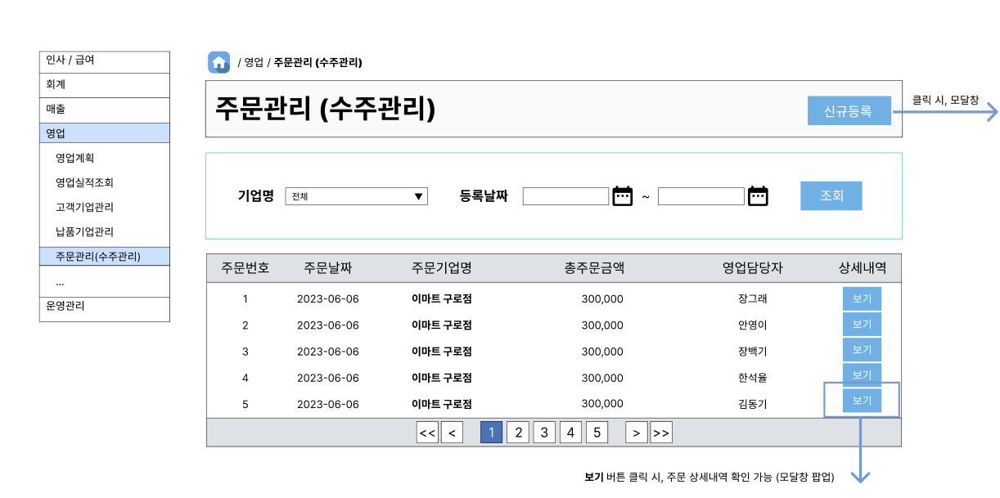
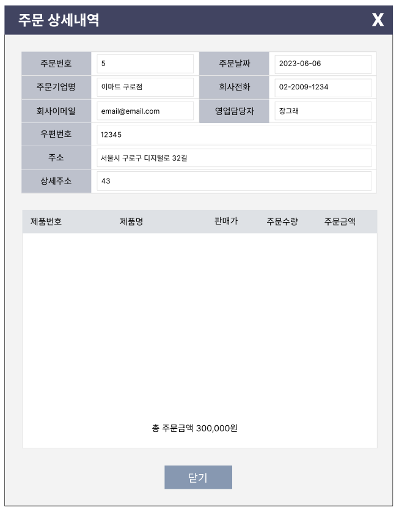

# ✅[6/16] 주문관리 SQL Query (READ)

> 1. 주문 목록 조회
> 2. 주문 목록 카운트 조회
> 3. 주문 한건 조회


## 1. 주문 목록 조회



```sql
-- 1. 주문 목록 조회 화면

--- 1-1. 기본형
SELECT order_no    -- 주문번호
      ,order_date  -- 주문날짜
      ,clnt_no     -- 주문기업명(tb_clnt 에서 JOIN)
      ,order_tot_price  -- 총주문금액
      ,loginID     -- 영업담당자(tb_emp 에서 JOIN)
   FROM tb_order;
   
--- 1-2. 완성형
SELECT od.order_no      -- 주문번호
      ,DATE_FORMAT(od.order_date, '%Y-%m-%d') AS order_date    -- 주문날짜
      ,cl.clnt_name
      ,FORMAT(od.order_tot_price, 0) AS order_tot_price    -- 총주문금액
      ,ep.name
   FROM tb_order od
      INNER JOIN tb_clnt cl ON od.clnt_no = cl.clnt_no
      INNER JOIN tb_emp ep ON od.loginID = ep.loginID;
```


## 2. 주문 목록 카운트 조회

```sql
-- 2. 주문 목록 카운트 조회 화면
SELECT COUNT(*)
   FROM tb_order od
      INNER JOIN tb_clnt cl ON od.clnt_no = cl.clnt_no
      INNER JOIN tb_emp ep ON od.loginID = ep.loginID;
```


## 3. 주문 한건 조회



```sql
-- 3. 주문 한건 조회 화면(모달 - layer2)

--- 3-1. 기본형
SELECT * 
   FROM tb_order_dt ot
      INNER JOIN tb_order od ON od.order_no = ot.order_no 
  WHERE od.order_no = 1;  -- .xml 파일엔 '1' 이 적힌 자리에 #{order_no} 이런 식으로 들어감
  
--- 3-2. 기본형2 (Inline View)
SELECT ot.order_no       -- 주문번호
      ,pd.product_no     -- 제품번호(tb_product 에서 JOIN)
      ,pd.product_name   -- 제품이름
      ,pd.product_price  -- 판매가
      ,cl.clnt_no        -- 주문기업명(tb_clnt 에서 JOIN)
      ,cl.clnt_name
      ,cl.clnt_tel     -- 회사전화
      ,cl.clnt_email   -- 회사이메일
      ,cl.clnt_zip     -- 우편번호
      ,cl.clnt_add     -- 주소
      ,cl.clnt_add_dt  -- 상세주소
      ,ot.order_dt_amt   -- 수량
   FROM tb_order_dt ot
      INNER JOIN tb_product pd ON pd.product_no = ot.product_no
      INNER JOIN tb_clnt cl ON cl.clnt_no = ot.clnt_no;

--- 3-3. 완성형 (3-2. Query 를 FROM 절에 Inline View 로 작성)
SELECT od.order_no
      ,DATE_FORMAT(od.order_date, '%Y-%m-%d') AS order_date
      ,ll.clnt_name
      ,ll.clnt_tel
      ,ll.clnt_email
      ,od.loginID   -- tb_emp 에서 name 가져옴(바로 아래 작성한 Scalar Subquery 참조)
      ,(SELECT ep.name FROM tb_emp ep INNER JOIN tb_order od ON ep.loginID = od.loginID) AS name
      ,ll.clnt_zip
      ,ll.clnt_add
      ,ll.clnt_add_dt
      ,ll.product_no
      ,ll.product_name
      ,ll.product_price
      ,ll.order_dt_amt
      ,(ll.product_price * ll.order_dt_amt) AS selamt  -- 상품별 주문금액
      ,od.order_tot_price   -- INSERT Query 작성할 때 계산된 총주문금액이 채워질 수 있도록
   FROM (
            SELECT ot.order_no       -- 주문번호
                  ,pd.product_no     -- 제품번호(tb_product 에서 JOIN)
                  ,pd.product_name   -- 제품이름
                  ,pd.product_price  -- 판매가
                  ,cl.clnt_no        -- 주문기업명(tb_clnt 에서 JOIN)
                  ,cl.clnt_name
                  ,cl.clnt_tel     -- 회사전화
                  ,cl.clnt_email   -- 회사이메일
                  ,cl.clnt_zip     -- 우편번호
                  ,cl.clnt_add     -- 주소
                  ,cl.clnt_add_dt  -- 상세주소
                  ,ot.order_dt_amt   -- 수량
               FROM tb_order_dt ot
                  INNER JOIN tb_product pd ON pd.product_no = ot.product_no
                  INNER JOIN tb_clnt cl ON cl.clnt_no = ot.clnt_no
        ) ll 
      INNER JOIN tb_order od ON od.order_no = ll.order_no;  
```


## 4. 주문 한건 조회 (수정)

> 3. 주문 한건 조회 와 같이 작성하면 "Subquery returns more than 1 row." 에러가 발생하므로, 아래와 같이 수정할 것

```sql
SELECT ot.order_no
	  ,cl.clnt_name
	  ,pd.product_no
	  ,pd.product_name
	  ,pd.product_price
	  ,ot.order_dt_amt
	  ,(pd.product_price*ot.order_dt_amt) AS detail_price
	FROM tb_order_dt ot
		 INNER JOIN tb_clnt cl ON ot.clnt_no = cl.clnt_no
		 INNER JOIN tb_product pd ON ot.product_no = pd.product_no
   WHERE ot.order_no = 1;  /* .xml 은 1 을 #{order_no} 로 수정 */
```


## 5. 주문 한건 카운트 조회

> = 주문 상세 목록 카운트 조회

```sql
SELECT COUNT(*)
	  FROM tb_order_dt ot
		   INNER JOIN tb_clnt cl ON ot.clnt_no = cl.clnt_no
		   INNER JOIN tb_product pd ON ot.product_no = pd.product_no
	 WHERE ot.order_no = 1;  /* .xml 은 1 을 #{order_no} 로 수정 */
```

